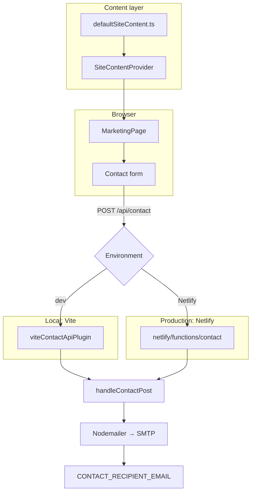

# Harithasuwa

Marketing website for **Harithasuwa** (හරිතසුව) — 100% natural dehydrated fruit from Sri Lanka, starting with embul, seeni, and rathambala banana.

Live stack: **React + Vite + Tailwind CSS v4**, content-driven sections, and a **serverless contact/order API** (Vite middleware locally, Netlify Function in production).

---

## Features

- Bilingual brand lockup (Sinhala · English)
- Content model ready for a future CMS (`SiteContent`)
- Per-section show/hide via `sectionVisibility` in `defaultSiteContent.ts`
- Order / contact form → email via SMTP (Nodemailer)
- Brand splash loader + scroll reveal animations (`motion`)
- Placeholder admin area at `/admin`

---

## Tech stack

| Layer | Choice |
|--------|--------|
| UI | React 18, React Router 7 |
| Build | Vite 6 |
| Styling | Tailwind CSS 4, CSS variables in `src/styles/theme.css` |
| Motion | `motion` (formerly Framer Motion) |
| Icons | `lucide-react` |
| Toasts | `sonner` |
| Email | `nodemailer` over SMTP |
| Hosting | Netlify (static `dist/` + Functions) |

---

## Architecture



### Request flow (order form)

1. User submits the form in `ContactSection`.
2. Client calls `POST /api/contact` (`submitContactForm.ts`).
3. **Local:** Vite middleware (`server/viteContactApiPlugin.ts`) handles the route.
4. **Netlify:** `netlify.toml` rewrites `/api/contact` → `/.netlify/functions/contact`.
5. Shared logic in `server/handleContactPost.ts` validates the body and sends mail via `server/sendContactEmail.ts`.

### Content model

All marketing copy, images, products, and section visibility live in:

- `src/content/types.ts` — TypeScript shapes
- `src/content/defaultSiteContent.ts` — default site document
- `src/content/SiteContentContext.tsx` — React provider (`useSiteContent()`)

Toggle sections without deleting code:

```ts
sectionVisibility: {
  hero: true,
  visionMission: true,
  products: true,
  benefits: true,
  testimonials: false, // hidden until real reviews
  contact: true,
},
```

Hidden sections are also removed from the navbar and footer links.

### Folder map

```
├── api/contact.ts              # Legacy handler (not used on Netlify)
├── netlify/
│   ├── functions/contact.ts    # Production serverless endpoint
│   └── …                       # (netlify.toml at repo root)
├── server/
│   ├── contactTypes.ts         # Payload validation
│   ├── handleContactPost.ts    # Shared POST handler
│   ├── sendContactEmail.ts     # Nodemailer SMTP
│   └── viteContactApiPlugin.ts # Local /api/contact
├── src/
│   ├── app/App.tsx             # Routes + providers
│   ├── content/                # Site content CMS model
│   ├── features/
│   │   ├── marketing/          # Public site
│   │   └── admin/              # Admin placeholder
│   ├── shared/                 # Fonts, utils
│   └── styles/                 # Tailwind + theme tokens
├── .env.example                # Env template
├── netlify.toml                # Build, functions, redirects
└── vite.config.ts
```

---

## Getting started

### Prerequisites

- Node.js 20+ recommended
- npm (or pnpm/yarn)

### Install & run

```bash
npm install
cp .env.example .env
# Edit .env with real SMTP credentials (see below)
npm run dev
```

Open [http://localhost:5173](http://localhost:5173).

### Scripts

| Command | Purpose |
|---------|---------|
| `npm run dev` | Vite + local contact API |
| `npm run build` | Production static build → `dist/` |
| `npm run netlify:dev` | Optional: Netlify CLI (functions + site together) |

---

## Environment variables

Copy `.env.example` → `.env` for local development. **Never commit `.env`** (it is gitignored).

| Variable | Required | Description |
|----------|----------|-------------|
| `SMTP_HOST` | Yes | SMTP server hostname |
| `SMTP_PORT` | Yes | Usually `587` (STARTTLS) or `465` (SSL) |
| `SMTP_SECURE` | No | `true` for port 465, else `false` |
| `SMTP_USER` | Yes | SMTP username / email |
| `SMTP_PASS` | Yes | SMTP password or app password |
| `SMTP_FROM` | No | From header (defaults to `SMTP_USER`) |
| `CONTACT_RECIPIENT_EMAIL` | Recommended | Inbox for orders (overrides form recipient) |
| `CONTACT_EMAIL_SUBJECT` | No | Custom subject line |

### Example `.env` (Gmail)

```env
SMTP_HOST=smtp.gmail.com
SMTP_PORT=587
SMTP_SECURE=false
SMTP_USER=harithasuwaproducts@gmail.com
SMTP_PASS=xxxx xxxx xxxx xxxx
SMTP_FROM="Harithasuwa Orders <harithasuwaproducts@gmail.com>"
CONTACT_RECIPIENT_EMAIL=harithasuwaproducts@gmail.com
```

**Gmail notes**

1. Enable 2-Step Verification on the Google account.
2. Create an [App Password](https://myaccount.google.com/apppasswords) and use it as `SMTP_PASS` (not your normal password).
3. Free Gmail SMTP has sending limits; for production volume prefer Brevo, Mailgun, or Resend SMTP.

---

## Email on Netlify — does it work?

**Not until SMTP env vars are set and the site is redeployed with `netlify.toml` + the function.**

| Environment | Contact API | Needs `.env` / Netlify env |
|-------------|-------------|----------------------------|
| `npm run dev` | Vite plugin → `/api/contact` | Local `.env` |
| Netlify (static only, no function) | **Broken** (404 on `/api/contact`) | — |
| Netlify + this repo’s `netlify.toml` | Function at `/.netlify/functions/contact` | **Site env vars required** |

### Configure Netlify

1. Connect the Git repo (or deploy `dist/` with the Netlify config included).
2. **Site configuration → Environment variables** — add the same keys as `.env` (`SMTP_*`, `CONTACT_RECIPIENT_EMAIL`).
3. Trigger a new deploy so `netlify/functions/contact` is built.
4. Confirm redirects: `/api/contact` → function (`netlify.toml`).
5. Submit a test order on the live site and check the inbox + Netlify function logs.

### Verify after deploy

```bash
curl -i -X POST "https://YOUR-SITE.netlify.app/api/contact" \
  -H "Content-Type: application/json" \
  -d '{
    "recipientEmail": "harithasuwaproducts@gmail.com",
    "name": "Test User",
    "phone": "+94 77 000 0000",
    "address": "Test address",
    "orderDetails": "Embul 100g x 1"
  }'
```

Expect `200` with `{"ok":true}` when SMTP is configured correctly.

### Troubleshooting Netlify `500` on `/api/contact`

1. **Env vars missing on Netlify** — Local `.env` is not uploaded. Add every `SMTP_*` key under Site configuration → Environment variables, then **redeploy**.
2. **Gmail From / User mismatch** — `SMTP_FROM` must use the **same** address as `SMTP_USER`. Gmail rejects other From addresses.
3. **App Password** — Use a Google App Password (16 characters). Normal account passwords fail with `EAUTH`.
4. **Check Function logs** — Netlify → Functions → `contact` → logs for `[contact] …`.
5. After fixing env vars, redeploy (or trigger a clear cache redeploy) so Functions pick up the new values.

---

## Deployment (Netlify)

Build settings (also encoded in `netlify.toml`):

- **Build command:** `npm run build`
- **Publish directory:** `dist`
- **Functions directory:** `netlify/functions`

SPA fallback sends unknown paths to `index.html`. The `/api/contact` rewrite is registered **before** the SPA rule so the form keeps working.

---

## Design tokens

Primary brand greens and cream live in `src/styles/theme.css`:

- Background `#F5F0E8`, primary `#2D6A4F`, secondary/gold `#E9C46A`
- Display: Playfair Display · Body: DM Sans · Mono: DM Mono

---

## Admin

`/admin` is a read-only placeholder preview of `SiteContent`. Future work: auth, content editing UI, and `setContent()` / API persistence.

---

## License / attribution

See `ATTRIBUTIONS.md` for third-party credits. Product concept and branding belong to Harithasuwa.
